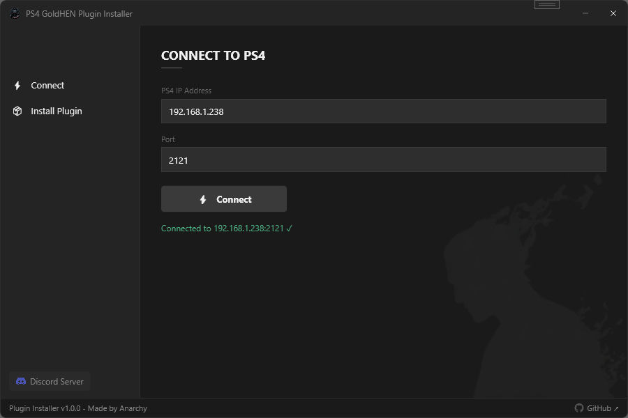
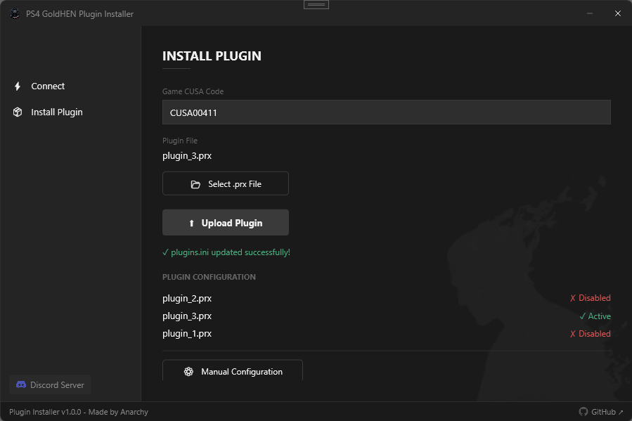

# PS4 GoldHEN Plugin Installer

  

A clean and simple Windows tool for installing PS4 plugins over FTP via GoldHEN.
Built for the GTA V community — but works for any GoldHEN plugin.

---

## Features

- Connect to your PS4 directly via FTP
- Upload `.prx` plugin files with one click
- Automatic `plugins.ini` configuration
- Detects and safely deactivates conflicting plugins
- Manual plugin manager with toggle switches
- One-click revert to original config
- Saves your IP, port and CUSA code between sessions

---

## Requirements

- PS4 with **GoldHEN** installed and running
- **FTP enabled** on your PS4
- Windows 10 or Windows 11

---

## How to use

**1. Connect**

  

- Enter your PS4 IP address (find it in PS4 Settings → Network)
- Port is `2121` by default
- Click **Connect**

---

**2. Install Plugin**

  

- Enter your game CUSA code (e.g. `CUSA00411` for GTA V EU)
- Click **Select .prx File** and choose your plugin
- Click **Upload Plugin**
- The tool automatically updates `plugins.ini` for you

---

**3. Done!**

Restart your PS4 game and your plugin will be active.

---

## Plugin Configuration

The installer automatically:
- Uploads your `.prx` file to `/data/GoldHEN/plugins/`
- Finds or creates the correct `[CUSAXXXXX]` section in `plugins.ini`
- Keeps `LSOPlugin.prx` active (for GTA V LSO players only)
- Deactivates conflicting plugins to prevent crashes
- Verifies the config was written correctly

If a plugin was deactivated you will see a notice with the option to
manually re-enable it via **Manual Configuration** or revert entirely.

---

## CUSA Codes — GTA V

| Region | CUSA Code |
|--------|-----------|
| EU | CUSA00411 |
| US | CUSA00419 |

> Not sure about your CUSA code? Check your game in the PS4 library.

---

## Download

👉 [Latest Release](https://github.com/AnarchyNR/PS4-GoldHEN-Plugin-Installer/releases/latest)

No installation required — just download and run the `.exe`

---

## Community

---

## Disclaimer

This tool is provided as-is for educational purposes.
Use at your own risk. We are not responsible for any damage to your console.
